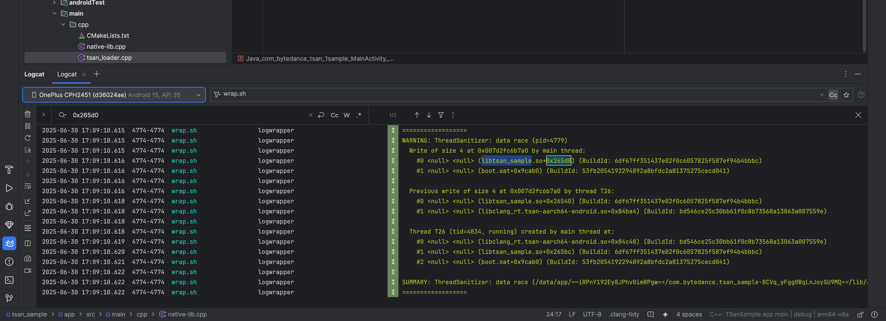
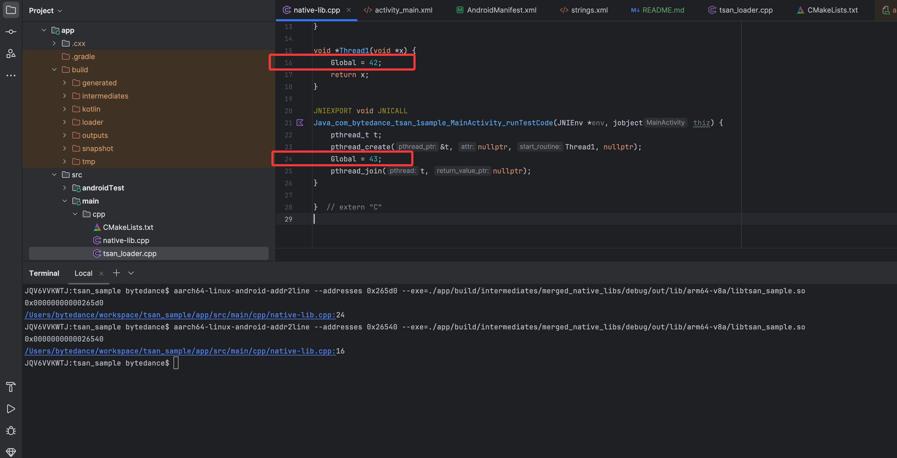

# Android ThreadSanitizer (TSan) Sample
This is an Android sample that demonstrates how TSan works on the Android platform.

## TSan Loader
- Disable address space layout randomization ([ASLR](https://en.wikipedia.org/wiki/Address_space_layout_randomization)).
- Add the TSan runtime library to LD_PRELOAD so that it can intercept related APIs.

## Build TSan Runtime Library
The code of [libclang_rt.tsan-aarch64-android.so](app/src/main/jniLibs/arm64-v8a/libclang_rt.tsan-aarch64-android.so) is currently under review. If you want to build the runtime library, please check out the code from [llvm/llvm-project#147580](https://github.com/llvm/llvm-project/pull/147580), and follow the [Android Clang/LLVM Toolchain Build Instructions](https://android.googlesource.com/toolchain/llvm_android/+/main/BUILD.md).

## Screenshots



## License
```
Copyright (c) 2025 Bytedance Ltd. and/or its affiliates

Licensed under the Apache License, Version 2.0 (the "License");
you may not use this file except in compliance with the License.
You may obtain a copy of the License at

    http://www.apache.org/licenses/LICENSE-2.0

Unless required by applicable law or agreed to in writing, software
distributed under the License is distributed on an "AS IS" BASIS,
WITHOUT WARRANTIES OR CONDITIONS OF ANY KIND, either express or implied.
See the License for the specific language governing permissions and
limitations under the License.
```
